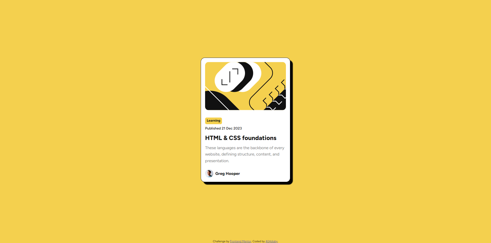
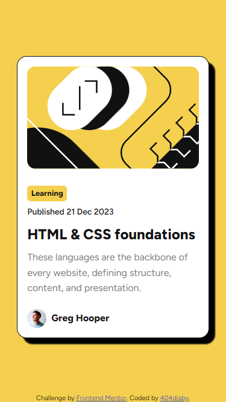

# Frontend Mentor - Intro component with sign up form solution

This is a solution to the [Intro component with sign up form challenge on Frontend Mentor](https://www.frontendmentor.io/challenges/intro-component-with-signup-form-5cf91bd49edda32581d28fd1). Frontend Mentor challenges help you improve your coding skills by building realistic projects. 

## Table of contents

- [Overview](#overview)
  - [The challenge](#the-challenge)
  - [Screenshot](#screenshot)
  - [Links](#links)
- [My process](#my-process)
  - [Built with](#built-with)
  - [What I learned](#what-i-learned)
  - [Continued development](#continued-development)
  - [Useful resources](#useful-resources)
- [Author](#author)
- [Acknowledgments](#acknowledgments)

## Overview

### The challenge

Users should be able to:

- See hover and focus states for all interactive elements on the page

### Screenshot

### Links
- Solution URL: [Github - repository](https://github.com/404diaby/blog-preview-card)
- Live Site URL: [Vercel - hosting](https://blog-preview-card-beta-nine.vercel.app/)

## My process

### Built with

- Semantic HTML5 markup
- Flexbox
- CSS custom properties
- Mobile-first workflow

### What I learned

### Continued development

I will try to use CSS variable concept. It's interesting and powerful. I will continue to learn about this concept

### Useful resources

## 🔗 Author

